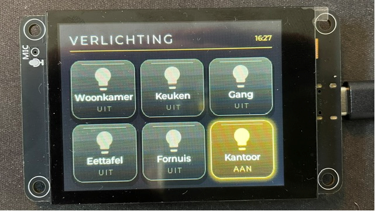
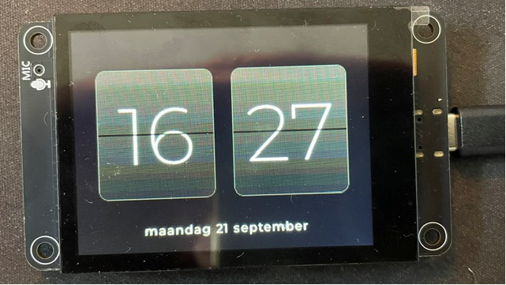

# ESPHome light panel for the LCDWIKI ES3C28P

A working ESPHome configuration for the **LCDWIKI ES3C28P** — a 2.8" IPS
ESP32-S3 touch display module — used as a six-light control panel for Home
Assistant, with an LVGL interface and a flip-clock screensaver.

The board is barely documented for ESPHome, and several of its quirks only
show up on real hardware. Everything below was verified on a physical device,
not inferred from datasheets. If you own this board, the
[Hardware notes](#hardware-notes) section is probably why you are here.

| | |
|---|---|
|  |  |
| Six lights, one per tile, grouped by room per column. A light that is on gets a warm gradient and a **gold** drop shadow instead of a black one, so the tile reads as emitting light rather than floating above the background. | The screensaver, after 30 s idle. The seam runs *over* the digits rather than behind them — that is what makes it read as a split-flap instead of two boxes with numbers in them. |

## The board

| | |
|---|---|
| MCU | ESP32-S3-WROOM-1 **N16R8** — 16 MB flash, 8 MB octal PSRAM |
| Display | ILI9341**V**, 240x320 IPS, 4-wire SPI |
| Touch | **FT6336G** capacitive, I²C `0x38` |
| Audio | ES8311 codec, I²C `0x18`, on-board microphone and an external speaker header (unused here) |
| Storage | MicroSD over SDIO (unused here) |
| RGB LED | WS2812B on GPIO42 |
| Power | 5 V in over USB-C; on-board charging for a 3.7 V LiPo (not included) |
| Size | 50.0 x 86.0 x 10.6 mm; active display area 43.2 x 57.6 mm |
| Temperature | -30 to 80 °C operating |

### Pinout

| Function | GPIO | | Function | GPIO |
|---|---|---|---|---|
| LCD SCK | 12 | | Touch SDA | 16 |
| LCD MOSI | 11 | | Touch SCL | 15 |
| LCD MISO | 13 | | Touch INT | 17 |
| LCD CS | 10 | | Touch RST | 18 |
| LCD DC | 46 | | RGB LED | 42 |
| Backlight | 45 | | SD (CLK/CMD/D0-D3) | 38/40/39/41/48/47 |

**The LCD reset is tied to the module's RST line, not to a GPIO.** Do not set
`reset_pin` on the display — configs copied from generic ILI9341 tutorials
will fight the hardware here.

### Power and mechanical

Figures from the vendor manual, which matter if you are designing an enclosure
or picking a supply:

| | |
|---|---|
| Display only | 140 mA, 0.7 W |
| Display + speaker + battery charging | 560 mA, 2.8 W |
| Active display area | 43.20 x 57.60 mm |
| Viewable window (through the touch glass) | 45.20 x 59.45 mm |
| Module | 50.00 x 86.00 x 10.60 mm |
| Backlight | 4 white LEDs, 230 cd/m² with the touch layer |

This config drives the display only, so **140 mA** is the number to plan for —
any phone charger will do. The 560 mA figure assumes a speaker and battery
charging, neither of which this project uses.

#### Running it on a battery

The board takes a **3.7 V LiPo** with on-board charge management (4.2-6.5 V in,
500 mA max charge current), so a cable-free panel needs no extra hardware.
Before you plan around that, the arithmetic:

0.7 W out of a 3.7 V cell, after roughly 12% conversion loss, is about 210 mA
drawn from the battery.

| Cell | Backlight at full | Mostly idle at 25% |
|---|---|---|
| 1000 mAh | ~4 h | ~5 h |
| 2000 mAh | ~8 h | ~11 h |
| 3000 mAh | ~13 h | ~16 h |

**The backlight is not what drains it — WiFi is.** Dimming to 25% buys you an
hour or two; the ESP32-S3 holding a live connection to Home Assistant accounts
for most of the draw. That connection cannot be dropped, because the panel has
to receive state changes or what it displays stops matching reality. Deep sleep
is therefore off the table: it would break the one thing the panel is for.

Switching the backlight fully off during the screensaver instead of dimming it
is the only lever that really moves the number — roughly 15 h on 2000 mAh, over
20 h on 3000 mAh — and it costs you the clock at night.

So a battery is good for riding out a power cut, or for moving the panel around
for an evening. It is not a way to run a wall panel permanently: even a large
cell needs charging daily, and at 500 mA that takes some five hours. For a
fixed installation, wire it. At 0.7 W it costs under two euros a year to run.

These figures are derived from the vendor's 140 mA / 0.7 W display-only rating,
not measured.

For the enclosure, mind the **connector angle** rather than the cable: a
straight USB-C plug adds around 20 mm to the depth, so a right-angle connector
matters more than a flat cable if you want the panel close to the wall.

### Where to get one

Search for the SKU **ES3C28P** — that string is what identifies this exact
module, and sellers reuse it even when the listing title says nothing else
useful. It turns up on AliExpress and on Amazon; one Dutch listing at the time
of writing is [B0G12SVX2H](https://www.amazon.nl/dp/B0G12SVX2H). Marketplace
links rot, so treat that as an example rather than a recommendation.

Note that these boards are usually sold as a **voice assistant** platform
(listings mention XiaoZhi AI), which is why there is an ES8311 audio codec and
a microphone on a light switch panel. This config leaves both unused.

Vendor resources: [wiki page](https://www.lcdwiki.com/2.8inch_ESP32-S3_Display),
[3D model](https://www.lcdwiki.com/res/ES3C28P/ES3C28P_3D.zip),
[dimensions](https://www.lcdwiki.com/res/ES3C28P/ES3C28P_Size.pdf),
[schematic](https://www.lcdwiki.com/res/ES3C28P/2.8inch_ESP32-S3_Display_Schematic.pdf).

The vendor also ships an English manual and a full product library, both over
plain HTTP from a bare IP, so expect your browser to complain and expect the
links to rot:
`http://8.217.75.21/Industrial/Multilingual/CBAA0051-037_UK.pdf` and
`http://8.217.75.21/Industrial/Multilingual/AM15-FBBA0125-AAB-ProductLibrary.zip`.
The manual's pinout and dimension pages are images, not text, so the pin table
in this README was taken from the wiki and verified against a running board.

## Hardware notes

These are the things that cost real debugging time.

### PSRAM is mandatory, not optional

A 240x320 16-bit framebuffer is ~150 kB and will not fit in internal RAM
alongside the WiFi stack. ESPHome does **not** enable PSRAM automatically —
without the `psram:` block the display simply will not come up.

### Landscape: rotate via MADCTL, not via `rotation:`

With `rotation:` other than 0, the `ili9xxx` driver falls back to a slow
per-pixel draw path, which matters a lot under LVGL. Use `transform:` with
`swap_xy` instead, which is a hardware MADCTL change and costs nothing.

Note that `transform:` **replaces the model defaults entirely**, so any mirror
the panel needed in portrait has to be restated explicitly.

### The touchscreen does not follow the display rotation

This one is easy to miss. The touchscreen component uses its **own**
`transform:` and scales raw values against `get_native_width()`. Rotating only
the display gives you a correct image with every tap landing 90° off.

On this panel, measured: the touch **Y axis arrives inverted**. A tap on a
button spanning y 152–202 reported y=59–77 — exactly 240 minus the true value,
while X was correct. Hence `swap_xy: true` plus `mirror_y: true`.

### `on_touch` fires before LVGL processes the touch

Switching pages from the touchscreen's `on_touch` means LVGL then reads the
still-pressed finger on the *newly shown* page and activates whatever is under
it. Dismissing a screensaver this way will toggle a light by accident.

Use `on_release` instead — the finger is already off the glass. A full-screen
invisible LVGL button on the screensaver page looked like the tidier solution
but did **not** work on this hardware.

### `monochromatic` applies gamma correction 2.8 by default

Intended to make dimming feel linear for room lighting, it is actively unhelpful
for a backlight: `brightness: 12%` becomes `0.12^2.8` ≈ **0.26% duty**, i.e.
effectively off. Set `gamma_correct: 1.0` so a percentage means that percentage.

### SPI tops out at 40 MHz here

80 MHz produces visibly grainy text on this board — the edges do not make it
and bits flip in the pixel data. There is nothing in between: the ESP32-S3
derives the SPI clock by integer division of 80 MHz, so the options are
80 / 40 / 26.7 / 20, and ESPHome rejects `60MHz` outright.

At 40 MHz a full 320x240 16-bit frame takes ~31 ms. That is the ceiling, and it
means **full-screen page animations are not viable** on this panel — a slide or
fade has only a handful of frames to work with and visibly stutters. This config
therefore switches pages instantly and puts the transition in the backlight
fade, which is PWM and unaffected by draw speed.

### Touch driver logs a harmless error at boot

`[E][FT63X6]: FT6336U touch driver failed to start` appears on every boot. In
`ft63x6.cpp`, `hard_reset_()` pulls reset low, waits 10 ms, releases it, and
then immediately reads the chip ID — before the FT6336 is awake. The read
returns 0 and trips the error branch. The driver carries on and touch works.

## What the panel does

- **3x2 grid of six lights**, grouped by room per column. Tap toggles; long
  press opens a dimming page with an arc for that light.
- Tile state is driven entirely by Home Assistant, so the panel follows changes
  made from anywhere. All six tiles are re-synced on every API connection, which
  also covers Home Assistant restarts.
- **Flip-clock screensaver** after 30 s idle, backlight down to 25%.
- **Night assist**: waking the panel between 23:00 and 07:00 turns on the stair
  light if it is off — no hunting for a button half asleep.

## Translating

Every string the panel shows is a substitution at the top of
[`touchpanel.yaml`](touchpanel.yaml). Nothing user-visible is hardcoded further
down, so translating means editing one block:

```yaml
  ui_title:  "VERLICHTING"     # header
  ui_on:     "AAN"             # tile state when the light is on
  ui_off:    "UIT"
  ui_toggle: "AAN / UIT"       # button on the dimming page
  ui_light:  "Lamp"            # placeholder until the light name is filled in
  ui_weekdays: '"zondag", "maandag", ...'   # Sunday first
  ui_months:   '"januari", "februari", ...' # January first
```

Weekday and month order is fixed: ESPHome's `day_of_week` counts from 1 for
Sunday and `month` from 1 for January.

**There is no automatic language detection.** Home Assistant does not expose its
UI language as an entity and ESPHome has no API for it, so there is nothing to
query. Locale-aware `strftime` is not an option either — ESP-IDF's newlib has no
usable locale support, so `%A` and `%B` would give you English at best. Hence the
explicit lists.

### Accented characters need a wider glyph set

By default ESPHome only embeds the `GF_Latin_Kernel` glyph set — 116 characters,
which does **not** include `ä ö ü ß é à ñ å ø`. A German "Küche" or a French
"Salle à manger" would render with blanks, and you would only find out on the
device.

If your language needs them, add this to each text font under `font:`:

```yaml
    glyphsets: [GF_Latin_Core]
```

That set has 319 characters and covers German, French, Spanish and the Nordic
languages. It costs some flash, which is why it is not on by default — the
supplied config is Dutch and does not need it.

The icon fonts do not need this; they only carry a couple of explicit glyphs.

## Setup

```bash
python -m venv .venv
.venv/bin/pip install esphome          # .venv\Scripts\pip on Windows
cp secrets.yaml.example secrets.yaml   # then fill it in
```

Generate an API key with `openssl rand -base64 32`.

Edit the `light1_entity` … `light6_entity` substitutions at the top of
[`touchpanel.yaml`](touchpanel.yaml) to your own entities, then:

```bash
esphome run touchpanel.yaml --device COM3    # first flash over USB
esphome run touchpanel.yaml                  # afterwards, OTA
```

In Home Assistant, enable **"Allow the device to perform Home Assistant
actions"** in the ESPHome integration options. Without it the panel connects
and displays state correctly but every switch command is silently dropped.

### Windows: long paths

The ESP-IDF toolchain paths exceed the 260-character limit under the default
cache location, which surfaces as cryptic errors like
`fatal error: bits/c++config.h: No such file or directory`. Either enable long
path support, or point the toolchain somewhere short:

```powershell
$env:ESPHOME_ESP_IDF_PREFIX = 'C:\ESPHome\idf'
```

Also note that the ESP-IDF installer refuses to run under MSYS/Git Bash
(`ERROR: MSys/Mingw is not supported`). Use PowerShell or cmd.

## Files

| | |
|---|---|
| [`touchpanel.yaml`](touchpanel.yaml) | the panel |
| [`bringup.yaml`](bringup.yaml) | diagnostic config: corner keys for checking rotation and colour order, plus touch coordinate logging |
| [`secrets.yaml.example`](secrets.yaml.example) | template; `secrets.yaml` is gitignored |
| [`case/`](case/) | printable wall-mount enclosure, parametric OpenSCAD plus rendered STLs |

`bringup.yaml` is worth keeping. If anything ever looks wrong with wiring or
orientation, flashing it answers the question in one glance: red top-left,
green top-right, blue bottom-left, yellow bottom-right means rotation, mirroring
and colour order are all correct.

## Licence

MIT.
