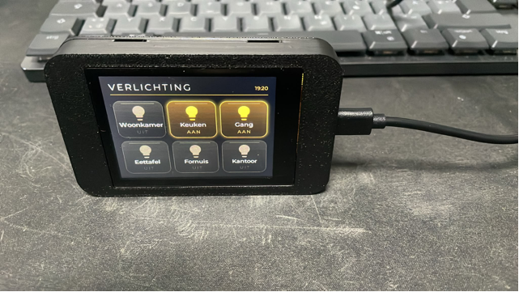

# Wall-mount enclosure for the ES3C28P

A parametric case for the LCDWIKI ES3C28P, landscape. The glass finishes flush
with the front, the board is trapped between the two halves, and the lid closes
on four sprung tabs. **No fasteners at all** beyond the two screws that put it
on the wall.

Outer size **96.1 x 60.1 x 13.8 mm**.

Source: [`es3c28p-case.scad`](es3c28p-case.scad). Every dimension is a named
parameter at the top.



## Built and verified

This has been printed and assembled, not just rendered. Confirmed on hardware:
board outline and hole pattern, the glass sitting flush, the USB-C opening, the
rim clearing the edge connectors, the snap gripping, the front levering back off
with a small screwdriver, the keyholes hanging the right way up, and the lid
sitting on the front without play.

Everything that did not work the first time is described below, because the
reasons are more useful than the result.

## Print the clip test first

Print [`cliptest-front.stl`](cliptest-front.stl) and
[`cliptest-back.stl`](cliptest-back.stl). Between them they are a slice of wall
and the matching slice of lid — a few grams, about fifteen minutes — and they
answer the one question the arithmetic cannot: does the snap actually grip, and
can you get it apart again.

The wall piece carries the groove and a pry slot; the lid piece carries a tab
with its flex slots either side. Press them together, then lever them apart.

If it grips too hard or not at all, `snap_depth` is the number. Only then commit
to the real parts.

They are two files rather than one deliberately. Two disconnected shells in a
single STL is the sort of thing a slicer is entitled to make a mess of.

`part = "test"` is the older fit check for the board outline and the glass
opening. Both of those are confirmed on hardware, so you can skip it unless you
change something.

## Why the case is wider than the board

The obvious layout puts the lid's rim behind the board. It does not work here:
the USB-C socket, the battery, UART and speaker connectors all sit right on the
board edge, and between the board and the wall there is 0.3 mm. Anything
reaching past the components fouls them.

Two ways out. Make the case deeper so the rim clears everything from behind, or
make it wider so the rim runs down the *side* of the board in a channel of its
own. Wider wins on every count:

| | deeper | wider |
|---|---|---|
| Size | 91.6 x 55.6 x 18.5 | **96.1 x 60.1 x 13.8** |
| Frame above and below the glass | 2.5 mm | **4.75 mm** |
| Tab length available to flex | 3 mm | **8 mm** |

That last row decided it. A 3 mm tab is far too stiff to deflect half a
millimetre without snapping off.

## The glass is flush with the front

The opening goes right through the bezel and the glass fills it, so the two
finish level. Printed in black the front reads as a single surface, with a
0.3 mm seam round the glass as the only interruption.

Two things follow. The glass carries nothing: the board is stopped by four pads
inside the bezel that its front face lands on. And with no bezel framing the
picture, the display being 3 mm off centre stops mattering.

`front_style = "lip"` is the alternative, leaving `glass_lip` of bezel in front
of the glass edge. No seam, but you see the step.

## The display is not centred on the board

Measured on hardware: the picture sits **3 mm off centre**, towards the
microphone end. The black glass border is 3 mm on that side and 9 mm on the
USB-C side. The vendor drawing gives the display and board sizes but never says
where one sits on the other.

`win_off_x = -3.00` accounts for it, and only matters in `lip` style.

**The window and the glass pocket have separate offsets, and they must.** The
picture is off centre within the glass; the glass sits square on the board.
Moving both together puts the pocket off the glass and the board will not seat.

## Printing

| | |
|---|---|
| Material | PLA is fine indoors; PETG if it will see sun |
| Layer height | 0.2 mm |
| Walls | 3 perimeters |
| Infill | 15% |
| Supports | **none needed** |
| Orientation | Front: bezel face down. Back: flat, outside down. |
| Print sequence | By layer, if you put both on one plate |

Print both together if you can. The peg spigots are 3 mm across and only seven
layers tall; printed alone they never get time to cool and come out soft.
Alongside the front, each layer takes long enough that they set properly.

Note that the bed texture prints into whatever faces down. On the textured PEI
plate the A1 ships with, the bezel comes out matte and grainy — which looks
deliberate in black. A smooth plate gives a gloss finish instead.

## Assembly

1. Screw the back plate to the wall through its keyhole slots.
2. Drop the board onto the four pegs. The spigots enter its mounting holes and
   locate it.
3. Press the front on, square. All four tabs deflect and click home.

That traps the board between the pegs behind and four stops inside the bezel.

## Taking it apart again

There are two pry slots in the bottom rear edge, one directly opposite each of
the bottom tabs. Put a flat screwdriver in and twist: that side releases, and
the top tabs follow as you lift the front away. Either slot works on its own.

One slot midway between them would have meant bending the whole bottom wall to
release two catches 22 mm away. Opposite the tabs the leverage lands exactly
where the barb holds.

The barbs are ramped on both faces on purpose. A one-way latch holds
beautifully and then has to be destroyed to get the board back.

## Why it pushes on square rather than hinging

Hanging the front on a ledge along the top and swinging it shut is the nicer
motion, and it was built that way for a while. It does not survive the
arithmetic at this size:

| | needed | available |
|---|---|---|
| Lift to clear a 0.65 mm ledge | 0.65 mm | 0.35 mm before the bottom rim binds |
| Tilt in at 4 degrees | 0.85 mm of side clearance | 0.35 mm |

A 12 mm deep bore will not pivot into a 0.35 mm gap, and widening that gap
costs the location the rim is there to provide. Four sprung tabs and a square
push cost nothing and cannot be assembled wrong.

## Tuning for your printer

| Parameter | What it does |
|---|---|
| `snap_depth` | How hard the lid clicks. The first number to touch. |
| `lip_fit` | Play between lid and front. Lower it if the front wobbles, raise it if the lid binds. Only affects the lid, so the front does not need reprinting. |
| `lip_clear` | Nominal channel width, and with it the outer size. Changing this means reprinting both halves. |
| `board_clear` | Gap beside the board. Raise if a connector fouls the rim. |
| `peg_clearance` | Slack on the board, and how far the glass sits below the surface. |
| `usb_w`, `usb_h`, `usb_off_z` | The USB-C opening. |
| `retention` | `clamp` for pegs, `screws` for four M3 x 5 in the front. |
| `front_style` | `flush` or `lip`. |

## Files

Rendered STLs are checked in, so you do not need OpenSCAD to print this.

| | |
|---|---|
| [`cliptest-front.stl`](cliptest-front.stl) | wall slice with groove and pry slot |
| [`cliptest-back.stl`](cliptest-back.stl) | lid slice with one sprung tab |
| [`front.stl`](front.stl) | bezel, walls, board stops |
| [`back.stl`](back.stl) | lid with rim, tabs, pegs and keyholes |
| [`test-frame.stl`](test-frame.stl) | board and glass fit check |

To re-render after changing a parameter you need
[OpenSCAD](https://openscad.org/):

```bash
openscad -D 'part="cliptest-front"' -o cliptest-front.stl es3c28p-case.scad
openscad -D 'part="cliptest-back"'  -o cliptest-back.stl  es3c28p-case.scad
openscad -D 'part="front"'          -o front.stl          es3c28p-case.scad
openscad -D 'part="back"'           -o back.stl           es3c28p-case.scad
openscad -D 'part="test"'           -o test-frame.stl     es3c28p-case.scad
```

Slicers read STL, not `.scad`.
